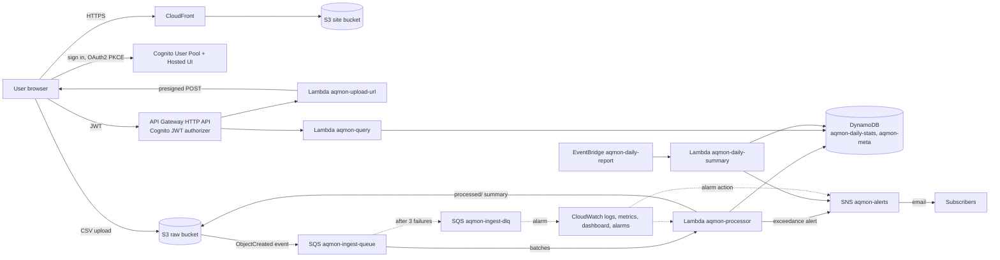

# AQMon Sydney – Air Quality Monitoring & Alert Platform

A distributed, event-driven cloud application on AWS. Users upload hourly
air-quality readings from Sydney's NSW Government monitoring stations. The
files are queued and processed by serverless functions. The results are
stored as daily statistics in DynamoDB and shown on a web dashboard with
charts and pollution-limit alerts.

## Architecture



| # | AWS service | What it does in this project |
|---|---|---|
| 1 | Amazon S3 | Raw CSV uploads and processing summaries (`aqmon-raw-…`); static frontend (`aqmon-site-…`) |
| 2 | AWS Lambda | 4 functions: upload URL, processor, query API, daily summary |
| 3 | Amazon API Gateway (HTTP API) | REST endpoints with a Cognito JWT authorizer, CORS and throttling |
| 4 | Amazon DynamoDB | `aqmon-daily-stats` (daily statistics), `aqmon-meta` (stations, uploads, alerts) |
| 5 | Amazon SQS | Ingest queue that decouples upload from processing, plus a dead-letter queue |
| 6 | Amazon Cognito | Sign-up/sign-in (Hosted UI, PKCE), `uploaders` group for authorisation |
| 7 | Amazon SNS | Exceedance alert emails, daily reports, alarm notifications |
| 8 | Amazon CloudWatch | Logs, custom metrics (EMF), dashboard, DLQ and error alarms |
| 9 | Amazon EventBridge | Daily schedule that triggers the summary report |
| 10 | Amazon CloudFront | HTTPS delivery of the dashboard from a private S3 bucket (OAC) |

All of it is deployed as code with AWS SAM/CloudFormation (`deploy/template.yaml`).

## Dataset

OpenAQ data archive on AWS (Registry of Open Data), public bucket
`s3://openaq-data-archive`. Four NSW Government stations in Sydney, January–June 2020:

| OpenAQ location id | Station |
|---|---|
| 7428 | Cook And Phillip (Sydney CBD) |
| 7425 | Parramatta North |
| 7426 | Macquarie Park |
| 7427 | Rouse Hill |

The 24 monthly CSV files are in `data/sydney/`. Regenerate them with
`python code/tools/fetch_openaq.py --start 2020-01 --end 2020-06`.

## Repository layout

```
code/backend/     Lambda handlers (one package) + aq_core.py processing logic
code/frontend/    Static dashboard (HTML/CSS/JS, Chart.js vendored)
code/tools/       fetch_openaq.py (dataset), local_server.py (run locally)
data/sydney/      Dataset files used for uploads
deploy/           SAM template and deploy/teardown scripts
docs/             Implementation guide, evidence register, test plan, demo, Q&A
images/           Evidence screenshots
tests/            pytest unit and pipeline tests (moto)
```

## Run locally

```bash
python3 -m venv .venv && source .venv/bin/activate
pip install -r requirements-dev.txt
pytest -q                                      # unit + end-to-end pipeline tests
python code/tools/local_server.py --preload    # http://localhost:8080/
```

The local server uses the same Lambda handlers against simulated AWS services
(moto). Authentication is bypassed in local mode only.

## Deploy to AWS

Requirements: AWS CLI v2 and AWS SAM CLI with credentials for the target
account. AWS CloudShell already has both.

```bash
ALERT_EMAIL=you@example.com ./deploy/deploy.sh                 # normal AWS account
ALERT_EMAIL=you@example.com LEARNER_LAB=1 ./deploy/deploy.sh   # AWS Academy Learner Lab
```

Then:

1. Confirm the SNS subscription email.
2. Open the dashboard URL and create an account.
3. Run `./deploy/add_uploader.sh <email>`, then sign in again.

See `docs/IMPLEMENTATION_GUIDE.md` for the full verified procedure.

Remove everything with `./deploy/teardown.sh`.
